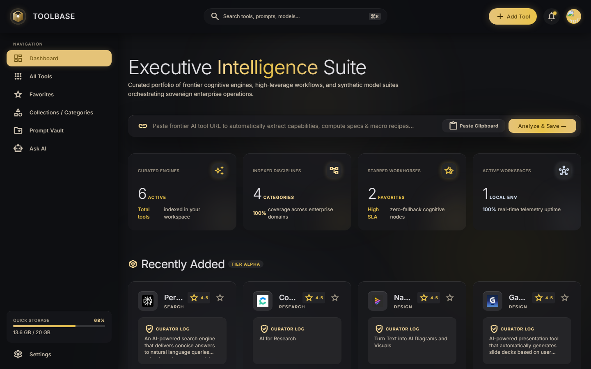
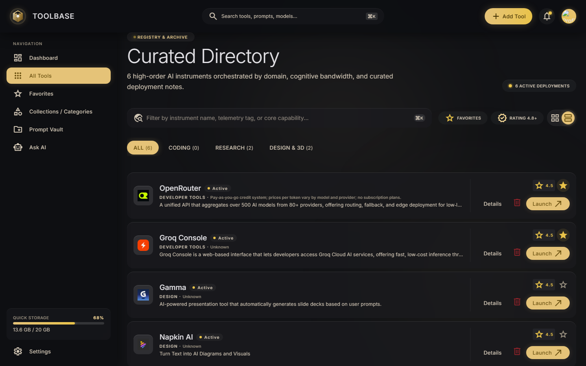
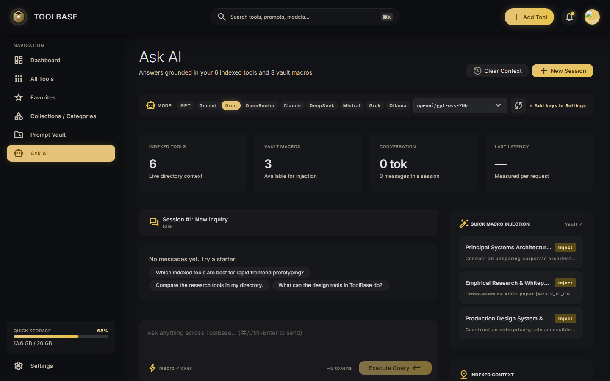
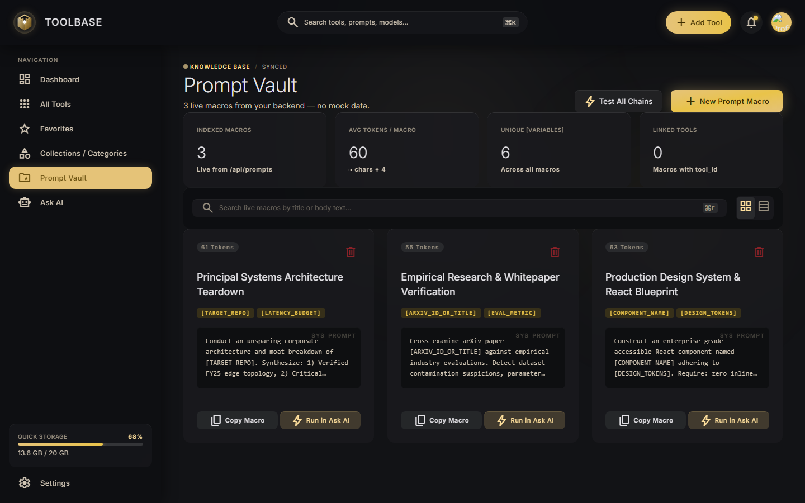
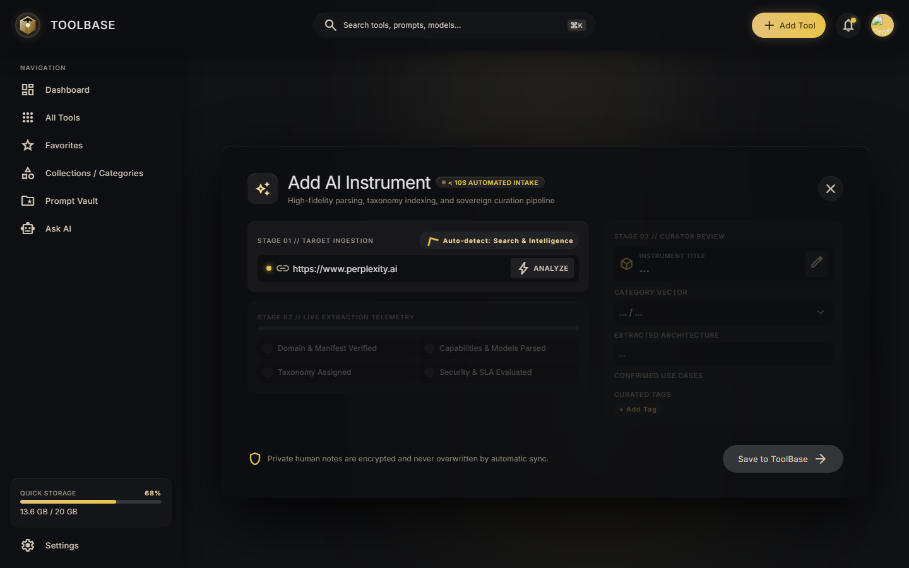
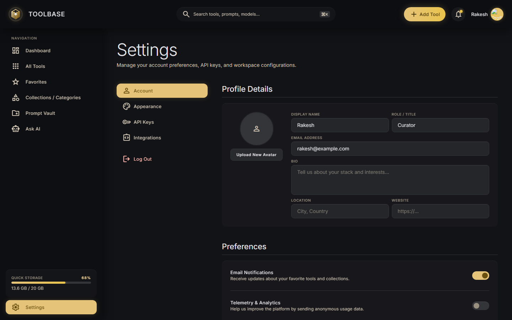
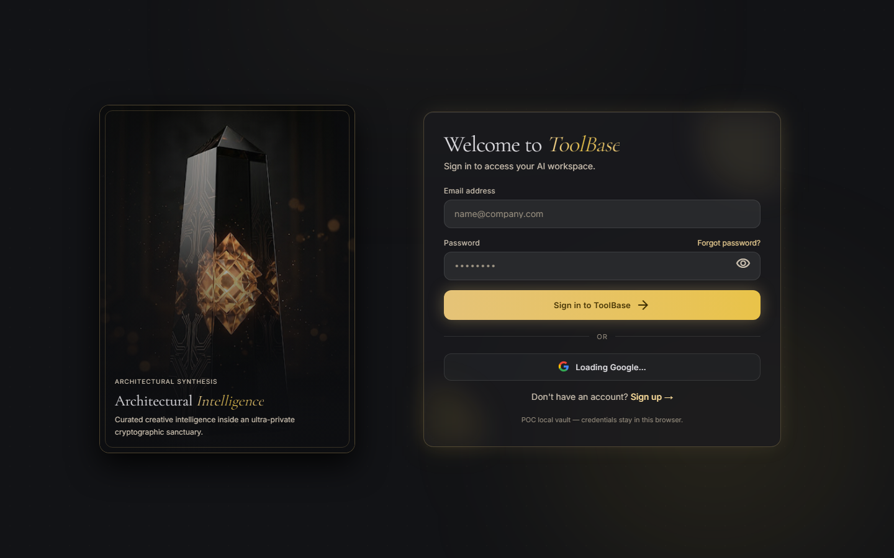
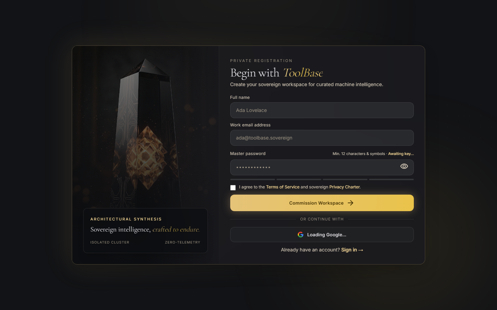

# ToolBase — Executive Intelligence Suite

A curated portfolio app for discovering, organizing, and chatting with your AI toolbox.
Save AI tools with auto-extracted metadata, organize them into collections, keep reusable
prompt macros in a vault, and ask an LLM questions grounded in your indexed tools.



## Features

### Dashboard (`/`)
Executive overview with live stats (indexed tools, categories, favorites), a quick-add bar that
analyzes any pasted tool URL (auto-extracts title, description, category, favicon), and recently added tools.

### All Tools (`/tools`) & Tool Detail (`/tools/[id]`)
Searchable catalog with ratings, favorites, notes, experiences, skills/artifacts, usage history,
and per-tool prompt macros. Brand favicons are auto-derived when a logo URL isn't provided.
Every card carries a **Global** (🌍 visible to all users) or **Private** (🔒 only you) badge.



### Ask AI (`/ask`)
Chat grounded in your indexed tools and vault macros. Shows model name, per-request latency,
token estimates, cited tools, starter prompts, macro injection, regenerate/copy answers, and
one-click **Fork to Prompt Vault**.



### Prompt Vault (`/vault`)
Create, organize, and inject reusable prompt macros into Ask AI sessions.



### Collections (`/collections`, `/collections/[category]`) & Favorites (`/favorites`)
Browse tools by category and keep a starred shortlist.

### Add Tool (`/add`)
Guided intake pipeline: paste URL → analyze (domain verified, capabilities parsed, taxonomy
assigned, security evaluated) → curator review → save. Admins choose **🌍 Global** (all users)
or **🔒 Private** (only me); regular users always save privately (enforced server-side).



### Settings (`/settings`)
Profile details (name, avatar upload/crop, role, bio, location, website), appearance
(dark/light/system, gold/blue/green/purple/custom accents, animated shader backdrops, font
size, density), per-provider API keys, integrations with connectivity tests, and log out.



### Auth (`/signin`, `/signup`) — OTP-first via Appwrite
Sign up / sign in with **Gmail OTP or phone OTP**: a 6-digit code proves the user is human
before any account exists (auto-advancing code boxes, paste support, resend cooldown).
Google OAuth and password flows remain as fallbacks. Sessions are real Appwrite sessions;
the backend validates the client JWT and syncs the profile into the **Appwrite DB `users`
collection** (source of truth for user details) plus the local mirror.




#### Appwrite Console setup (one-time)
1. Create a project at `cloud.appwrite.io` (note the region endpoint, e.g.
   `https://nyc.cloud.appwrite.io/v1`, and the project ID).
2. **Auth**: no extra config for Gmail OTP — it works out of the box.
3. **Phone OTP (SMS): ⏳ SKIPPED FOR NOW — DO THIS LATER.** Auth → Settings → enable Phone auth, then **Messaging → Providers →
   Create provider** (Twilio trial recommended: free test credit, verify your own number first —
   trial SMS only reaches verified numbers). Blocked on getting a number, so phone signup
   currently shows *"SMS not configured"* by design. Gmail OTP is unaffected and fully working.
4. **Database**: create database `toolbase` (+ table `users` with columns `userId, email,
4. **Database**: create database `toolbase` (+ table `users` with columns `userId, email,
   phone, displayName, avatar, role, bio, location, website`), plus the existing tool tables.
5. **API key**: Settings → API Keys → `toolbase-backend` with scopes `databases.read/write`,
   `storage.read/write`, `users.read` → `APPWRITE_API_KEY` in `backend/.env`.
6. Fill `backend/.env` (`APPWRITE_*`, `ADMIN_EMAILS`) and `frontend/.env.local`
   (`NEXT_PUBLIC_APPWRITE_*`) — see the `.env.example` files. Set `USE_APPWRITE=1` to serve
   tools/tags/prompts/artifacts from Appwrite tables; JWT identity + visibility rules apply
   in both modes (SQLite fallback otherwise).

### Roles & visibility (admin → global, user → private)
Set admin emails in `ADMIN_EMAILS` (backend `.env`). Admins' added tools are **public** —
visible in every user's dashboard, directory, collections, favorites, and Ask AI context.
Regular users' tools are **private**: only the owner sees them (lists filter them out,
direct links 404, and their videos/notes/MCP artifacts are hidden too). Only owners or
admins can edit, star, or delete a tool, and only admins can publish globally. Pre-existing
tools without an owner stay public, so nothing disappears on upgrade.

### Admin Portal (`/admin`, admins only)
Server-guarded mission control: account roster with per-user tool counts, plus every tool
**including private ones** with owner, visibility pill, Publish/Make-private toggle and
delete. The sidebar shows the Admin entry only for admins; everyone else is bounced to `/`.
Non-admins hitting `GET /api/auth/users` get `403`.

## Tech stack

| Layer    | Tech |
|----------|------|
| Frontend | Next.js 16, React 19, Tailwind CSS 4, `react-markdown` + `remark-gfm` |
| Backend  | FastAPI, SQLAlchemy (SQLite by default, PostgreSQL via `DATABASE_URL`), Pydantic |
| Auth     | Google Identity Services (OAuth2) + email/password (PBKDF2-SHA256) |
| AI       | Pluggable providers: OpenAI, Gemini, Groq, OpenRouter, Anthropic, DeepSeek, Mistral, xAI, Ollama |
| Tests    | pytest (backend, isolated temp DB), `tsc --noEmit` + `next build` + ESLint (frontend) |

## Project structure

```
AITool_APP/
├── frontend/                 # Next.js app
│   ├── src/app/              # Routes: page, add, admin, ask, collections, favorites,
│   │                         # settings, signin, signup, tools, vault
│   ├── src/components/       # AskClient, GoogleSignIn, AuthLux, Sidebar,
│   │                         # SettingsProvider, ProviderKeysManager, ...
│   ├── src/lib/              # settings, themes, shaders, providers
│   ├── public/               # toolbase logo/mark, auth monolith art
│   └── .env.example          # copy to .env.local
├── backend/                  # FastAPI app
│   ├── app/main.py           # app + CORS + table creation + light migrations
│   ├── app/api/              # tools, ai, prompts, artifacts, provider-keys,
│   │                         # integrations, auth
│   ├── app/models/domain.py  # Tool, Tag, Prompt, ToolArtifact, ProviderKey, User, ...
│   ├── tests/                # pytest suite (auth + tools smoke tests)
│   ├── requirements.txt
│   └── .env.example          # copy to .env
├── docs/screenshots/         # README images (captured from the running app)
└── stitch_assets*/           # Stitch design mockups (reference only)
```

## Getting started

### 1. Backend

```powershell
cd backend
python -m venv venv
.\venv\Scripts\Activate.ps1
pip install -r requirements.txt
copy .env.example .env   # then fill in keys (see below)
python -m uvicorn app.main:app --reload   # http://127.0.0.1:8000
```

### 2. Frontend

```powershell
cd frontend
npm install
copy .env.example .env.local   # then fill in (see below)
npm run dev                    # http://localhost:3000
```

### 3. Environment variables

Backend (`backend/.env`):

| Key | Purpose |
|-----|---------|
| `LLM_PROVIDER` | `gemini` or `groq` (default provider for Ask) |
| `GEMINI_API_KEY` / `GROQ_API_KEY` | Provider keys |
| `OPENAI_API_KEY` / `ANTHROPIC_API_KEY` / `DEEPSEEK_API_KEY` / `MISTRAL_API_KEY` / `XAI_API_KEY` / `OPENROUTER_API_KEY` | Optional env fallback keys (Settings → API Keys takes precedence) |
| `GEMINI_MODEL` / `GROQ_MODEL` | Model IDs |
| `ADMIN_EMAILS` | Comma-separated admin emails — admins publish tools globally, everyone else saves privately |
| `APPWRITE_ENDPOINT` / `APPWRITE_PROJECT_ID` / `APPWRITE_API_KEY` | Appwrite Cloud (key needs `databases.read/write`, `storage.read/write`, `users.read` + `users.write`) |
| `APPWRITE_DATABASE_ID` / `APPWRITE_BUCKET_ID` | Defaults: `toolbase` / `toolbase-media` |
| `USE_APPWRITE` | `1` to serve data from Appwrite tables instead of SQLite |
| `DATABASE_URL` | Optional; defaults to local `aitoolbox.db` (SQLite) |
| `SECRET_KEY` | App secret |
| `GOOGLE_CLIENT_ID` | Google OAuth Web client ID (same value as frontend) |

Frontend (`frontend/.env.local`):

| Key | Purpose |
|-----|---------|
| `NEXT_PUBLIC_BACKEND_URL` | e.g. `http://localhost:8000` |
| `NEXT_PUBLIC_GOOGLE_CLIENT_ID` | Same Google OAuth client ID (enables the account chooser) |
| `NEXT_PUBLIC_APPWRITE_ENDPOINT` / `NEXT_PUBLIC_APPWRITE_PROJECT_ID` | Same Appwrite project (public values, enables OTP + sessions) |

Google setup: Cloud Console → OAuth consent screen → Credentials → OAuth client ID (Web) →
Authorized JavaScript origins: `http://localhost:3000` → paste the client ID into both env files.

> Never commit `.env` / `.env.local` — they are git-ignored. Only the `.example` files are tracked.

## API reference (backend)

| Method & path | Description |
|---------------|-------------|
| `POST /api/auth/signup` | Register (rejects used email / taken username with 409) |
| `POST /api/auth/signin` | Email+password login (401 on wrong credentials) |
| `POST /api/auth/check-email` / `check-username` | Live availability checks for signup |
| `PATCH /api/auth/profile` | Sync Settings profile edits (survive re-login) |
| `POST /api/auth/google` / `google-token` | Verify Google ID token / access token, upsert user |
| `POST /api/appwrite/sync` | Validate OTP-login JWT, upsert profile into Appwrite DB `users` + local mirror |
| `GET /api/auth/me` | Caller identity + `is_admin` (reads `X-User-Email`) |
| `GET /api/auth/users` | Admin-only roster with per-user tool counts (`403` otherwise) |
| `GET/POST /api/tools/` | List (visibility-filtered per caller) / register tools (auto favicon, duplicate-URL guard; non-admins forced private) |
| `GET /api/tools/{id}` | Tool detail (404 unless visible to caller) |
| `PUT /api/tools/{id}` / `PUT .../favorite` / `DELETE ...` | Owner-or-admin only; only admins can set `visibility=public` |
| `POST /api/ai/ask` | Grounded chat (`{question, macro, provider, model}`) |
| `GET/POST /api/prompts/` | Prompt vault macros |
| `GET/POST /api/provider-keys/` | Per-provider LLM keys & models (keys never returned) |
| `GET /api/provider-keys/options` / `/models` | Saved keys + live available-model listing per provider |
| `DELETE /api/provider-keys/{id}` | Remove a provider key |
| `POST /api/integrations/test` | Probe an integration endpoint (SSRF-guarded) |
| `GET /api/artifacts/...` | Per-tool notes/skills/links |

## Testing

Backend (23 tests, isolated temp SQLite — never touches `aitoolbox.db`):

```powershell
cd backend
.\venv\Scripts\python -m pytest tests/ -q
```

Covers: signup + validation, duplicate email/username (case-insensitive), availability
endpoints, signin success/wrong-password/Google-only messaging, profile PATCH + error cases,
Google re-login preserving edits, tools CRUD, and visibility rules (private hidden from other
users, admin publish/see-all).

Frontend gates:

```powershell
cd frontend
npx tsc --noEmit   # types
npm run build      # production build, all 12 routes
npx eslint src/app/signin/page.tsx src/app/signup/page.tsx src/app/settings/page.tsx src/components/GoogleSignIn.tsx
```

Manual QA checklist: every page returns 200; sign up → duplicate blocked; sign in (good +
bad password); edit profile → save → log out → Google login → edits intact; add tool via
URL analyze; ask a question; fork answer to vault.

## POC limitations (before production use)

- Provider keys are stored in **plaintext SQLite**; profile avatars can be large data-URLs.
- Auth has no sessions/JWT — identity is verified per request and mirrored to localStorage.
- Email/password flows fall back to a local vault when the backend is unreachable.
- `fetch_screens*.ps1` contain a Stitch API key — rotate it and keep such keys out of git.

## License

Private proof-of-concept. All rights reserved.
